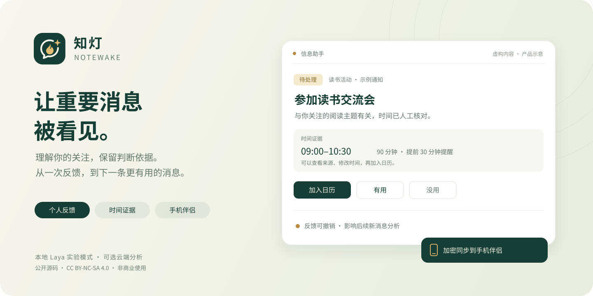
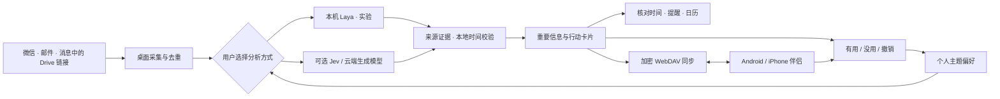

<div align="center">



# 知灯 Notewake

**让重要消息被看见。**

把 999+ 未读，整理成值得关注的信息与下一步行动。

结合你的关注与反馈，把微信、邮件里的消息整理为有依据、可确认、可提醒的事项。

[](LICENSE)
[](package.json)
[](https://github.com/maqinsgen/-laya-)

[开始使用](#开始使用) · [使用指南](使用指南-信息助手.md) · [本地模型](LAYA_LOCAL.md) · [架构说明](TODO_ASSISTANT_ARCHITECTURE.md) · [手机伴侣](mobile/README.md) · [隐私说明](SECURITY.md)

</div>

消息刷过去，活动时间、需要回复的请求和真正有用的信息很容易沉底。知灯把这些内容放回一个可以处理的地方：你能看到它为什么被选中、核对原文、设置时间，也能告诉助手“这条有用”或“这条没用”。

这是基于 **[CipherTalk](https://github.com/ILoveBingLu/CipherTalk)** 的非商业派生项目，原作者为 **[ILoveBingLu](https://github.com/ILoveBingLu)**。本分支重做了信息助手流程、反馈学习、日期证据、品牌与手机伴侣体验，保留上游署名及 **CC BY-NC-SA 4.0** 许可。当前提供源码与构建入口；完整许可见[下方说明](#署名与许可)。封面为虚构内容示意，不是真实聊天截图。

## 你能用它做什么

| 能力 | 具体体验 |
| --- | --- |
| **按你的关注筛选消息** | 填写学习、生活或研究上的关注方向，查看重要度、判断理由、主题与来源。区分行动事项和有用信息。 |
| **用反馈调整偏好** | 标记“有用 / 没用”，也能撤销。后续新消息分析参考主题反馈；你可以检查偏好画像并关闭学习。 |
| **让日期有据可查** | 展示时间引文、采用的时区与待确认状态，支持人工设置、修改或清除提醒时间。 |
| **把事项带进日历** | 系统通知、单条加入日历、批量 `.ics` 导出。明确的活动结束时间会保留，9:00–10:30 的交流会就是 90 分钟。 |
| **在手机上查看和反馈** | 桌面采集分析，Android / iPhone 伴侣同步加密结果；离线可查看缓存，联网后继续同步。 |
| **选择本地或云端分析** | 本机 Laya 实验模式、可选 Jev 判断接口及原有生成模型分别配置，数据去向由你选择。 |

反馈学习调整的是内容偏好，不是替你推断人格或身份，也不会在线训练模型权重。已保存的卡片保留原分析结果，反馈主要影响下一批新消息。

## 工作方式



邮箱接入支持 Gmail OAuth 与 IMAP；应用内收件箱只读，不发信、不删信、不修改已读状态。Drive 接入读取消息中明确出现的链接，不遍历整个云盘。具体扫描范围和失败重试方式见[架构说明](TODO_ASSISTANT_ARCHITECTURE.md)。

## 开始使用

准备 **Node.js 22.12+**，以及当前平台需要的运行、构建环境和配套原生组件。本项目以 Electron 桌面应用为主；macOS 原生组件有系统版本与架构要求，详见 [macOS 说明](resources/macos/README.md)。

```bash
git clone https://github.com/maqinsgen/-laya-.git notewake
cd notewake
npm ci --legacy-peer-deps
npm run dev
```

首次使用按这个顺序：

1. **先看信息助手。** 可以手动补记事项，再连接需要的消息来源。
2. **选择分析方式。** 本地 Laya 需要单独部署；使用云端服务则填写你自己的服务地址、模型和 API Key。
3. **写下关注方向。** 例如“我关注课程、读书活动和需要我回复的安排”。
4. **执行扫描并核对。** 查看理由和原文，确认待处理事项的时间，再开启提醒或加入日历。
5. **留下反馈。** 用“有用 / 没用”调整下一次分析；需要手机时再配置加密同步。

完整操作见[使用指南](使用指南-信息助手.md)。修改源码不会更新已经安装的旧 App；本分支已停用上游自动更新，内部部分包名和数据路径保留 CipherTalk 以兼容旧配置。

**原生组件说明：** WCDB 等能力依赖预编译组件，本仓库不包含其完整私有源码，因此不能从本仓库重建全部原生依赖。请保留相关组件的来源和许可声明；安装包构建与发布边界见 [PUBLISHING.md](docs/PUBLISHING.md)。

### 微信连接

连接向导提供环境预检、手动填写密钥和支持环境下的自动获取。Apple Silicon Mac 已接入登录期捕获：

**退出微信账号并停留登录页 → 在知灯开始获取 → 管理员授权 → 等待“监听已就绪” → 微信登录并在手机确认 → 逐库验证后保存。**

该流程需要 LLDB、Python 运行时及可用的系统调试权限。预检受阻时应按界面提示处理；应用不会自动关闭 SIP、重签名或强制重启微信。取消后需等待监听和临时文件清理，失败不会替换原有连接配置。不同平台、系统和微信版本的支持边界及实际验证记录见 [macOS 读取说明](resources/macos/README.md)。

### 选择分析方式

| 方式 | 配置与数据去向 | 当前边界 |
| --- | --- | --- |
| **Laya 本机多语言模型** | 单独部署 `multilingual`，默认地址 `http://127.0.0.1:8000/v1/systemone`；回环地址无需 Key。 | **默认关闭，实验性排序。** 测试服务并明确启用后才使用。逐条判断，所有结果保留待确认，日期候选不自动变成提醒。 |
| **Jev 判断接口** | 独立 HTTPS 地址与专用 Key；候选消息和必要的个人关注摘要发送到所填服务。 | 固定选项判断，日期须经过来源证据校验；结果仍可能出错。 |
| **原有生成模型** | 在 AI 设置中选择服务商、模型和 API Key。 | 相关消息内容发送到所选服务；输出校验不等于判断绝对可靠。 |

本地模式不会在失败时自动切换到云端。Laya 上下文较短，超出输入预算的消息保留为本机待核对卡；这是本次采集文本，不能当作完整聊天归档。模型置信度也不等于真实准确率。

部署、合成样例实测及其限制完整记录在 [LAYA_LOCAL.md](LAYA_LOCAL.md)。先查看结果再决定是否启用；本项目不承诺消除幻觉、可靠自动筛除或适用于所有个人消息。

### Android / iPhone 伴侣

手机端位于 `mobile/`，采用 React + Capacitor。它同步桌面整理后的事项和反馈，不直接读取手机微信数据库，也不需要保存 AI Key。

```bash
npm --prefix mobile ci
npm --prefix mobile run build
cd mobile
npm run sync
```

Android 原生构建需要 JDK 21 与 Android SDK；iOS 需要完整 Xcode、签名和设备配置。**目前需要自行构建，不能把网页构建通过视为手机真机验收或应用商店上架。** 具体命令、凭据存储及发布检查见 [mobile/README.md](mobile/README.md)。

## 隐私边界说清楚

- **本机分析：** 使用项目启动器运行本机 Laya 时，推理在本机完成。首次安装和下载模型需要网络；微信、邮箱连接、授权或可选同步各有自己的数据边界，不能把整个应用概括为始终离线。
- **云端分析：** 启用 Jev 或云端生成模型，会向你配置的服务发送必要的候选消息及关注信息。请根据自己的数据要求选择服务和来源。
- **手机同步：** WebDAV 上传的是使用 PBKDF2-SHA-256 与 AES-256-GCM 加密的待办文档。恢复密钥由用户保管；服务器仍可看到网络请求及密文大小等元数据。
- **最小化有边界：** 原消息预览和证据引文默认不单独同步，但标题仍会同步，Laya / Jev 标题可能是短段原文；其他模式的详情、理由和反馈也包含在加密文档中。
- **公开仓库与反馈：** 不要提交微信密钥、API Key、OAuth 凭据、恢复密钥、数据库、邮件或聊天记录。提交问题时请使用虚构样例或脱敏后的最小复现。

## 当前状态

消息采集、个人反馈、日期证据、提醒与日历、加密同步和手机伴侣已经有实现与对应回归测试。需要分别看待“代码已实现”“合成测试通过”和“真实设备已验证”：

- Laya 仍是默认关闭的实验功能；已有小型合成测试不能外推为真实消息准确率。
- 桌面必须保持运行才能继续采集和扫描，休眠或关机不会在后台替你处理新消息。
- 手机真机权限、跨设备同步与各平台发布需要继续验收；当前不是独立采集微信消息的手机版。
- 安装包签名、公证、Google OAuth 发布配置和独立更新渠道，需要发行者自行完成。现有主进程部分旧模块仍有类型检查问题，Vite 构建成功不等于所有安装包均已验证。

详细状态以[使用指南](使用指南-信息助手.md)、[Laya 实测记录](LAYA_LOCAL.md)和[公开发布说明](OPEN_SOURCE_NOTES.md)为准。

## 源码导览

| 位置 | 内容 |
| --- | --- |
| [`src/pages/TodoPage.tsx`](src/pages/TodoPage.tsx) | 信息助手界面、反馈和时间确认 |
| [`electron/services/todoService.ts`](electron/services/todoService.ts) | 桌面采集、扫描编排、存储和提醒 |
| [`src/shared/`](src/shared/) | 日期证据、重要性规则、判断请求、日历与加密同步 |
| [`electron/services/todoJevService.ts`](electron/services/todoJevService.ts) | Laya / Jev 判断传输与响应校验 |
| [`mobile/`](mobile/) | Android / iOS 伴侣与原生能力 |
| [`scripts/`](scripts/) | 回归测试、本地模型部署与构建辅助 |

可从这些不需要真实账号的回归开始：

```bash
npm run test:todo-intelligence
npm run test:todo-date-evidence
npm run test:todo-calendar
npm run test:todo-sync
```

## 一起改进

欢迎提交[问题与建议](https://github.com/maqinsgen/-laya-/issues)或 [Pull Request](https://github.com/maqinsgen/-laya-/pulls)。尤其欢迎：中文消息的合成评测、日期歧义处理、可解释反馈、无障碍体验，以及 Android / iOS 真机验证。

问题报告请附上系统与应用版本、复现步骤、预期行为和脱敏示例。宣传介绍可直接参考 [ANNOUNCEMENT.zh-CN.md](docs/ANNOUNCEMENT.zh-CN.md)。

## 署名与许可

知灯 Notewake 基于 **CipherTalk** 修改，保留原作者 **ILoveBingLu** 的版权与署名。本仓库整体适用 [LICENSE](LICENSE) 中的 **CC BY-NC-SA 4.0**，完整文本见 [Creative Commons](https://creativecommons.org/licenses/by-nc-sa/4.0/legalcode.zh-Hans)：署名、非商业性使用、相同方式共享。它是公开源码的非商业派生版，**不是 MIT，也不能据此宣称可任意商用**。

- 上游项目：[ILoveBingLu / CipherTalk](https://github.com/ILoveBingLu/CipherTalk)。本分支修改不代表原作者、微信或腾讯的背书。
- 继承的功能参考致谢：[WeFlow](https://github.com/hicccc77/WeFlow) 与上游贡献者。
- 第三方声明：[Laya](THIRD_PARTY_NOTICES/Laya/README.md)、[Jev](THIRD_PARTY_NOTICES/Jev/README.md)、[WcdbKeyTool](THIRD_PARTY_NOTICES/WcdbKeyTool/NOTICE)。第三方组件各自的许可不改变桌面项目整体许可。
- `CipherTalk-CLI/` 的独立许可不能外推到整个仓库。品牌兼容安排和独立发行注意事项见 [OPEN_SOURCE_NOTES.md](OPEN_SOURCE_NOTES.md)。

请仅处理你有权访问的数据，并保留来源与许可说明。
